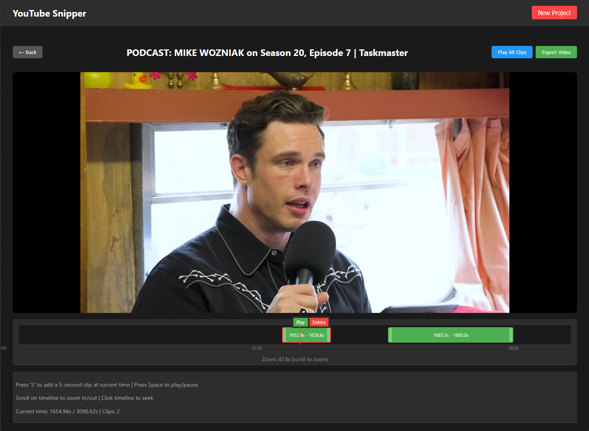

# YouTube Snipper 🎬✂️

**YouTube Snipper** is a simple little web application that lets you extract and combine the best moments from any YouTube video (or other supported video sources) into a single compilation clip. Perfect for creating highlight reels, funny moment compilations, or condensing long videos into their most valuable segments.

## ✨ What Does It Do?

Ever watched a long video and wished you could just extract the best parts? YouTube Snipper makes it easy:

1. **Download any video** from YouTube or other supported platforms
2. **Visually select clips** using an interactive timeline editor
3. **Preview your selections** before exporting
4. **Export a single video** containing only your chosen moments

Whether you're creating gaming highlights, educational summaries, or comedy compilations, YouTube Snipper streamlines the entire process into a simple, intuitive workflow.



---

## 🚀 Quick Start

### Option 1: One-File Install (No Cloning Needed)

You can run YouTube Snipper by simply downloading the [docker-compose.yml](https://github.com/Eckankar/youtube-snipper/raw/main/docker-compose.yml) file and placing it in a folder on your computer. This works great with platforms like **Dockge**, **Portainer**, or any system that can run Docker Compose.

1. **Download docker-compose.yml**
   - [Get the file here](https://github.com/Eckankar/youtube-snipper/raw/main/docker-compose.yml)
   - Place it in a folder (e.g. `youtube-snipper`)

2. **Create a `.env` file for configuration**
   - Download [`.env.example`](https://github.com/Eckankar/youtube-snipper/raw/main/.env.example) to the same folder and rename it to `.env`
   - Edit `.env` and configure:
     - **User permissions:**
       - **Windows users**: Use `UID=1000` and `GID=1000`
       - **Mac/Linux users**: Run `id -u` and `id -g` to get your IDs, then update `.env`
     - **Projects folder:** Set `PROJECTS_PATH` to where you want to store downloaded videos and projects
       - **Windows example**: `PROJECTS_PATH=C:/Users/YourName/youtube-snipper-data`
       - **Mac/Linux example**: `PROJECTS_PATH=/home/yourname/youtube-snipper-data`
       - If not set, defaults to `./projects` (a subfolder next to docker-compose.yml)

3. **Start the app**
   ```bash
   docker-compose up
   ```
   Or use your Docker Compose GUI (Dockge, Portainer, etc.) to start the stack.

4. **Open the app**
   - Go to [http://localhost:3000](http://localhost:3000) in your browser

5. **Stop the app**
   ```bash
   docker-compose down
   ```

---

### Option 2: Manual Install (Clone the Repo)

If you want to modify the code or run in development mode:

1. **Clone the repository**
   ```bash
   git clone https://github.com/Eckankar/youtube-snipper.git
   cd youtube-snipper
   ```

2. **Configure user permissions and projects folder**
   ```bash
   # On Windows (PowerShell):
   copy .env.example .env

   # On Mac/Linux:
   cp .env.example .env
   ```
   - Edit `.env`:
     - **User permissions:** Set `UID` and `GID` as above for your OS
     - **Projects folder:** Set `PROJECTS_PATH` to your desired location
       - If not set, defaults to `./projects` (a subfolder in the repository)
       - Consider using a location outside the repo if you want to persist data across repo updates

3. **Start the application**
   ```bash
   docker-compose up
   ```

4. **Open the app**
   - Go to [http://localhost:3000](http://localhost:3000)

5. **Stop the app**
   ```bash
   docker-compose down
   ```

---

## 📖 How to Use

### Creating Your First Project

1. **Click "New Project"** in the top-right corner
2. **Enter a project name** (optional - will auto-fill from video title if not given)
3. **Paste the video URL** from YouTube or another supported site
4. **Click "Create Project"**

The video will begin downloading automatically. Progress is shown with a live progress bar including download speed and estimated time remaining.

### Editing Your Clips

Once the video downloads, you'll see the editor interface:

#### Timeline Controls
- **Click the timeline** to jump to any point in the video
- **Press 'S'** to quickly add a 5-second clip starting at the current time
- **Press Space** to play/pause the video
- **Scroll on the timeline** to zoom in/out for precise editing

#### Working with Segments
- **Drag the edges** of any clip to adjust its start/end time
- **Drag the entire clip** to move it to a different part of the timeline
- **Click a clip** to select it and show controls
- **Click "Play"** on a segment to preview just that clip
- **Click "Delete"** to remove an unwanted segment
- **Use "Play All Clips"** to preview all segments in sequence

#### Exporting Your Video

1. Click **"Export Video"** when you're happy with your clips
2. Wait for processing (usually takes 30 seconds to a few minutes)
3. Your compiled video will download automatically

---

## 🐛 Troubleshooting

**Video won't download:**
- Check if the URL is from a supported site (YouTube, Vimeo, etc.)
- Some videos may be region-locked or age-restricted

**Permission errors on Linux/Mac:**
- Make sure your `UID` and `GID` in `.env` match your user
- Run `id -u` and `id -g` to find correct values

**Docker issues:**
- Try `docker-compose down -v` to clean up, then rebuild
- Make sure Docker Desktop is running
- For development: `docker-compose -f docker-compose.dev.yml down -v`

**Frontend won't load:**
- Wait 30 seconds after "webpack compiled" message
- Try hard refresh (Ctrl+Shift+R / Cmd+Shift+R)

**Images not updating:**
- Pull latest images: `docker-compose pull`
- For development, rebuild: `docker-compose -f docker-compose.dev.yml up --build`

---

## 💻 For Developers

If you want to contribute to or modify YouTube Snipper, please see [CONTRIBUTING.md](CONTRIBUTING.md) for:
- Project structure and tech stack
- Development setup with hot reload
- API documentation
- CI/CD pipeline details
- Environment variables reference

---

## ⚠️ Buyer beware

This project is largely "vibe-coded" — experimental, informal, and not production-hardened. It is intended for single-person use on a trusted internal network only. Do not expose backend or Redis services to the public Internet; use at your own risk.

---

## 📝 License

This project is open source and available under the MIT License.